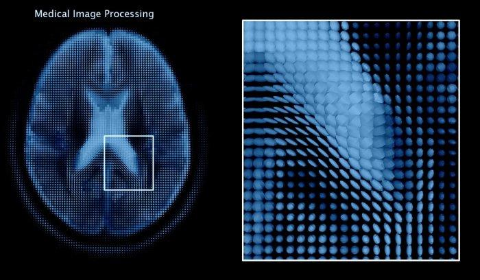

## Introducción

El análisis de imágenes se utiliza como una herramienta fundamental para reconocer, diferenciar y cuantificar diversos tipos de imágenes, incluidas imágenes en escala de grises y en color, imágenes multiespectrales para unos pocos canales espectrales discretos o bandas de ondas (normalmente menos de 10) e imágenes hiperespectrales con una secuencia de bandas de ondas contiguas que cubren una región espectral específica (por ejemplo, visible e infrarrojo cercano).

Es importante señalar que el análisis de imágenes es parte de un campo más amplio conocido como **procesamiento de imágenes**, donde el principal objetivo es mejorar la calidad visual de una imagen y/o extraer información o características útiles. El análisis se basa en diferentes propiedades de la imagen como el color, el brillo, la morfología de los objetos y la textura.

## Introducción

De acuerdo con Prats-Montalba´n et al. 2011, las acciones de procesamiento de imágenes se pueden agrupar en tres subáreas:

+ **Compresión de imagen** Reduce los requisitos de memoria al eliminar la redundancia presente en la imagen, es decir, la información de la imagen que no es perceptible para el ojo humano.

- **Preprocesamiento de imágenes** Consiste en mejorar la calidad visual de la imagen reduciendo el ruido, la calibración y estandarización de píxeles, mejorando la detección de bordes y haciendo que el análisis de la imagen sea más confiable en base a criterios objetivos y bien establecidos. El término preprocesamiento de imágenes, en general, se refiere a todas las manipulaciones en una imagen, cada una de las cuales produce una nueva imagen.

+ **Análisis de imágenes** Generalmente devuelve valores numéricos y / o información gráfica sobre las características de la imagen que son adecuadas para la clasificación, detección de defectos o predicción de algunas de las propiedades de calidad del objeto de la imagen. El término análisis de imágenes se utiliza cuando el resultado es un número o una decisión, no una imagen.

##
### **El análisis de imágenes como problema estadístico**

El análisis de imágenes visto como un análisis estadístico es un campo próspero que vió el surgimiento de varios avances estadísticos importantes, incluido, por ejemplo: **El muestreador de Gibbs**. Además, este campo ha adoptado predominantemente una **perspectiva bayesiana** tanto porque esto era algo natural de hacer como porque el poder analítico de este enfoque era mayor que con otros métodos. 

La razón de esta aparente paradoja es que, mientras que los píxeles suelen ser deterministas objetos, la complejidad y el tamaño de las imágenes requieren que uno represente esos píxeles como la salida aleatoria de una distribución gobernada por un objeto de dimensión mucho más pequeña. Por ejemplo, este es el caso de la visión por computadora, donde los objetos específicos deben extraerse de un fondo mucho más rico (o más ruidoso).

# Dependencia espacial

## Rejillas y Lattices

Una imagen (en el sentido de una imagen generada por computadora) es un caso especial de una celosía, en el sentido de que es un objeto aleatorio cuyos elementos están indexados por la ubicación de los píxeles y, por lo tanto, están relacionados por la proximidad geográfica de esas ubicaciones. 

En general, una celosía es un objeto matemático multidimensional en el que se puede definir una relación de vecindad.

## Modelo de Ising

Si los píxeles de la imagen $x$ bajo estudio sólo pueden tomar dos colores (blanco y negro), entonces $x$ es binario.De esta manera, nos referimos a cada pixel $x_{i}$ como:

+ **Primer plano:** Si $x_{i}=1$ (Negro)

- **Fondo:** $x_{i}=0$ (Blanco)

Además, la distribución condicional de un pixel es Bernoulli con el parámetro de probabilidad correspondiente dependiendo de los otros píxeles. Un paso de simplificación es asumir que es una función del número de píxeles vecinos negros, utilizando, por ejemplo, un enlace logit como $(j=0,1)$

$$\pi(x_{i}=j|x_{-i})\varpropto exp(\beta n_{i,j}), \hspace{2cm} \beta >0$$

Donde:

$n_{i,j}=\sum_{\ell \in n(i)}:$ Es el número de vecinos de $x_{i}$ con color j

## Modelo de Ising

El modelo de Ising se define a través de los siguientes condicionales:

$$\pi(x_{i}=1|x_{-i})=\displaystyle{\frac{exp(\beta n_{i,1})}{exp(\beta n_{i,0})+exp(\beta n_{i,1})}}$$

y la distribución conjunta por tanto satisface:

$$\pi(x)\varpropto exp\left(\beta \sum_{j\sim i} I_{x_{j}=x_{i}}\right)$$

Donde la suma se toma sobre todos los pares $(i,j)$ de vecinos.

## El modelo de Potts

Es la generalización del modelo de Ising a los casos en que la imagen tiene más de dos colores. 
$$n_{i,g}= \sum I_{xj}=g $$
Donde la distribución satisface que:

$$\pi(x)\varpropto exp\left(\beta \sum_{j\sim i} I_{x_{j}=x_{i}}\right)$$

## Segmentación de imágenes

Esta estructura subyacente de los píxeles "verdaderos" se denota por $x$, mientras que la imagen observada se denota por $y$. Ambos objetos $x$ e $y$ son matrices, con cada entrada de $x$ tomando un número finito de valores y cada entrada de $y$ tomando valores reales. Por lo tanto, estamos interesados en la distribución posterior de $x$ dada $y$ proporcionada por el teorema de Bayes:

$$\pi(x|y)\varpropto f(y|x)\pi(x)$$

En esta distribución posterior:

+ $f(y|x)$: La verosimilitud describe el vínculo entre la imagen observada y la clasificación subyacente; es decir, da la distribución del ruido.

- $\pi(x)$: La apriori codifica creencias sobre las propiedades (posibles o deseadas) de la imagen subyacente.

##
### **Pasos para el procesamiento y análisis de imágenes**

La visión artificial generalmente consta de los siguientes cinco pasos u operaciones:

{height=400px}

## Aplicaciones

+ **Medicina**

{height=200px}

## Ejemplo de aplicación

{width=500px}

## Ejemplo de aplicación

### **¿Qué es CNN?**

La red neuronal convolucional (CNN) es una clase de redes neuronales de aprendizaje profundo. En resumen, piense en CNN como un algoritmo de aprendizaje automático que puede tomar una imagen de entrada, asignar importancia (pesos y sesgos aprendibles) a varios aspectos / objetos en la imagen y poder diferenciar uno del otro. CNN funciona extrayendo características de las imágenes. 

Cualquier CNN consta de lo siguiente:

1. La capa de entrada que es una imagen en escala de grises.
2. La capa de salida, que es una etiqueta binaria o de varias clases.
3. Capas ocultas que constan de capas de convolución, capas ReLU (unidad lineal rectificada), capas de agrupación y una red neuronal completamente conectada

## Conclusiones

+ El campo del procesamiento y análisis de imágenes ha experimentado un crecimiento exponencial y su aplicación se ha generalizado cada vez más en los últimos años. 

- El desarrollo de algoritmos nuevos y más eficaces para el procesamiento y análisis de imágenes, junto con los avances en la adquisición de imágenes, la computadora, el almacenamiento de datos e Internet, han hecho posible manejar un volumen cada vez mayor de datos de imágenes. 

+ El procesamiento de imágenes digitales se ha vuelto económico en muchos campos de investigación y en aplicaciones industriales. Si bien cada aplicación es diferente o única de las demás, a todas les preocupa la velocidad, la asequibilidad y el rendimiento o la precisión. 

- Cada vez más actividades de investigación y aplicaciones en visión artificial se centran en operaciones interactivas y en tiempo real, donde la adquisición, el procesamiento, el análisis y la toma de decisiones de imágenes se realizan casi de forma simultánea o en paralelo.

## Bibliografía

+ Marin, J. M., & Robert, C. (2007). Bayesian core: a practical approach to computational Bayesian statistics. Springer Science & Business Media.

- Marin, J. M., & Robert, C. P. (2014). Bayesian essentials with R (Vol. 48). New York: Springer.

+ Mendoza, F., & Lu, R. (2015). Basics of image analysis. In Hyperspectral imaging technology in food and agriculture (pp. 9-56). Springer, New York, NY.

# ¡Gracias por tu atención!
